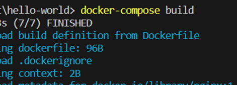
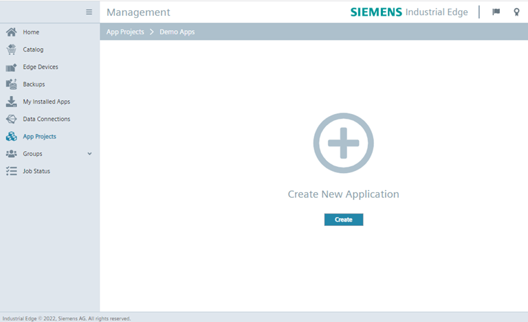
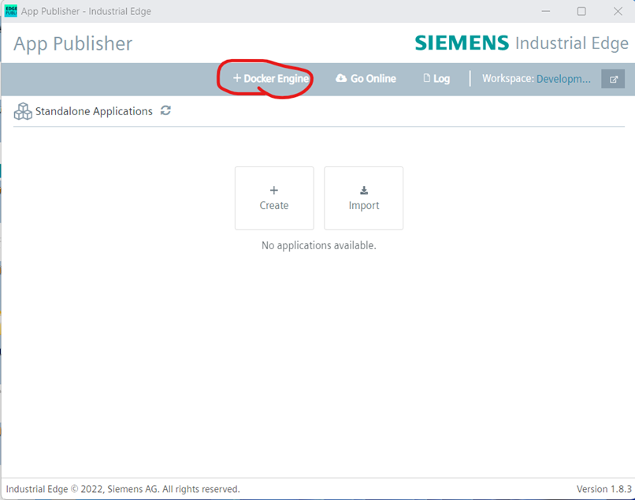
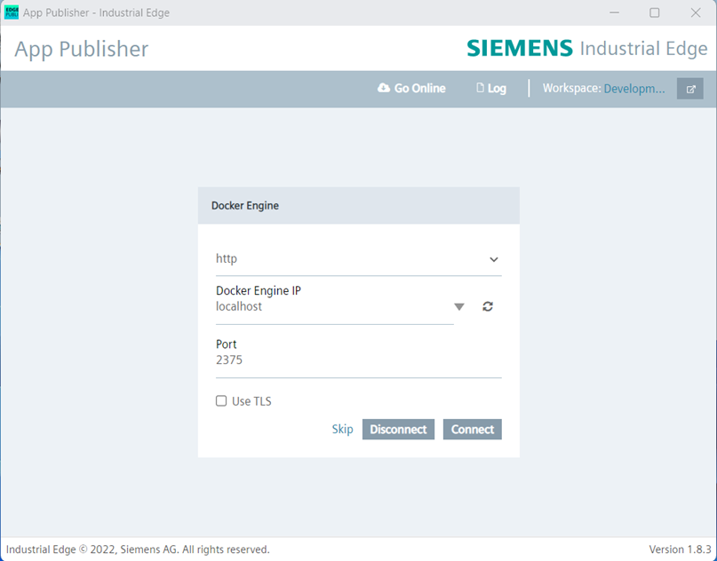
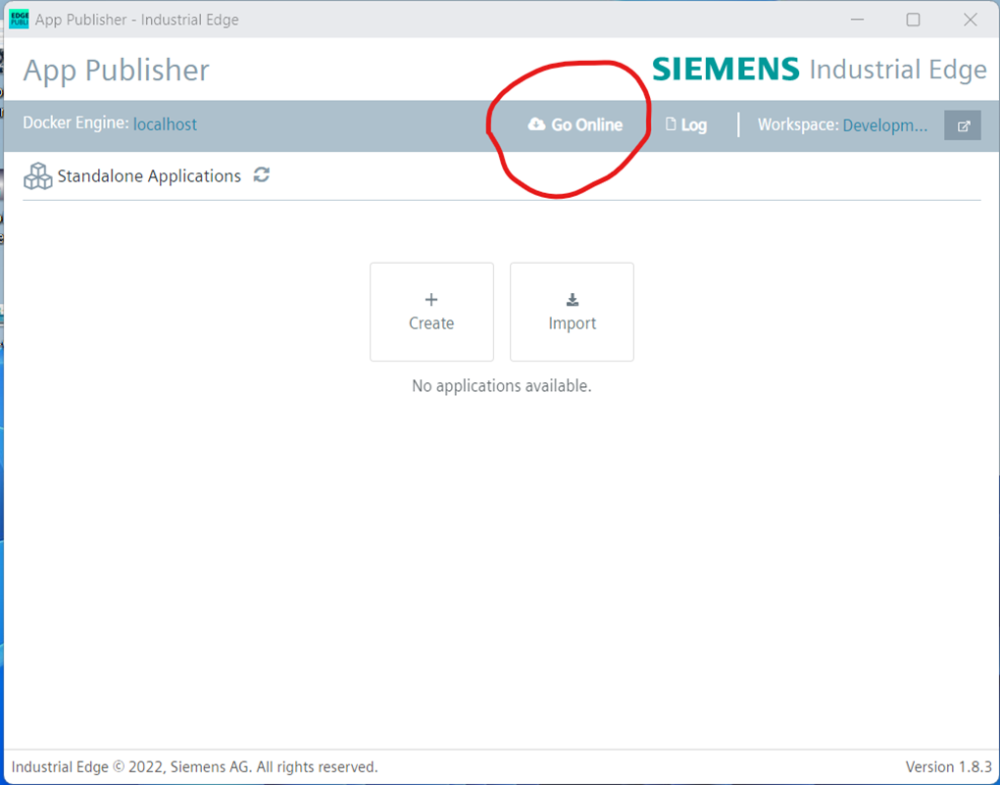
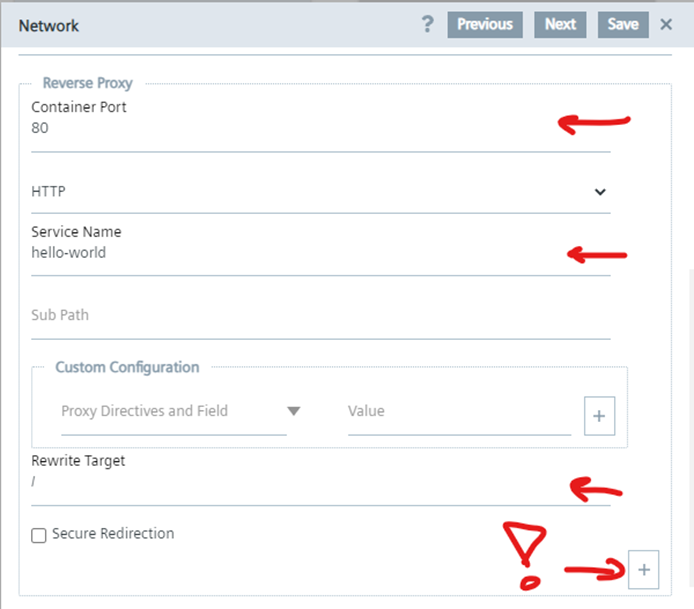
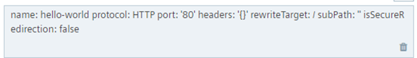
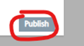
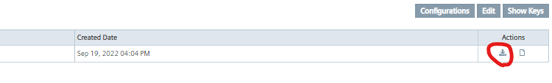

# Industrial Edge - Bring your own application

Steps

* Installation

  * Build Applicatiow
* Use Hello World
* Build Docker

  * Upload app to the management
* Connect Publisher
* Upload

  * Install App on edge Device
  * Use App

## Requirements

download https://github.com/industrial-edge/hello-world to your development folder

Install Docker engine and allow communication from outside

## Build application

* Open Visual Studio Code
* Open folder in visual studio code:
  * Development folder
* Build Docker in Visual Studio Code
  * Right click “hello-world”
  * Open in Integrated Terminal
    * Build docker image by typing:
      * Docker-compose build
        

## Create new App in the Industrial Edge Management

* login
* go to App-Projects > Create project
* Create a new app in the folder. Name it hello-world
* fill in all the fields
* create

  

## Setup the publisher

* Open the publisher
* Connect docker engine

  

  
* Connect publisher to the management

  
* In the publisher open
  Project > Hello-World
* Add new app version
* Import the docker-compose file at the import YAML button

  * Select the docker-compose.yml in the hello-world folder
  * Thewarnings can be ignored
* Configure the reverse proxy of the hello-world service, click edit button to change settings

  
* go to ”network” and setup the following

  
* Then click on + and you should see

  
* Press “Save”
* Click “Review” and “Validate and Create”
* Start upload to transfer to the management

## Install application on device

* Go to the IE Management
* Go to App Projects > Project
  * Open app > Hello-World
  * Publish the latest version to be used for everybody!

    
  * Press on the download icon and select your edge device

    
  * Install on your edge device

## Edge Device

Go to your edge device and the new app should be available

* [x] Dockerized an app
* [x] Uploading a app
* [x] Publishing App for other users
* [x] Setup a reverse Proxy
