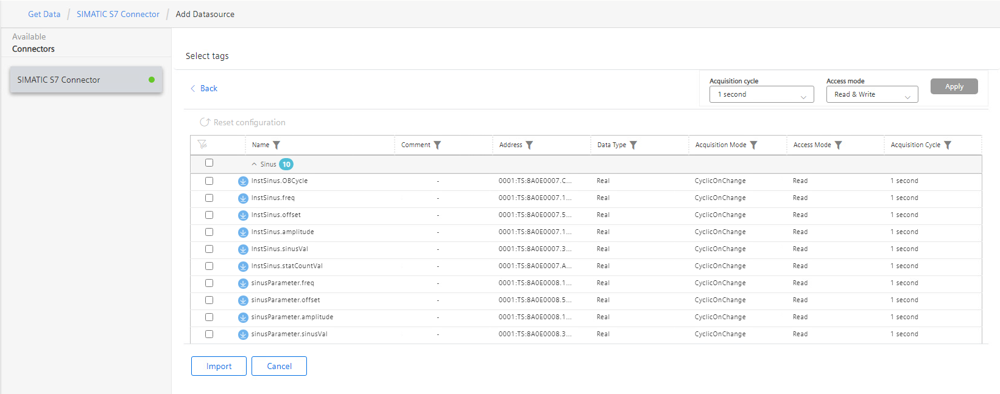

# Configuration

- [Configuration](#configuration)
  - [Configure PLC Connection](#configure-plc-connection)
    - [Configure the Databus](#configure-the-databus)
    - [Configure the SIMATIC S7 Connector](#configure-the-simatic-s7-connector)
  - [Configure Flow Creator](#configure-flow-creator)

## Configure PLC Connection

To read data from the PLC and provide the data, we will use the SIMATIC S7 Connector to establish connection with the PLC via S7.

The SIMATIC S7 sends the data to the Databus, where the Flow Creator app can collect what is needed.

In order to build this infrastructure, these apps must be configured properly:

- SIMATIC S7 Connector

### Configure the SIMATIC S7 Connector 

Simatic S7 Connector can be configured 

#### Local Configuration

In your Industrial edge device open the common configurator and configure the S7 connector

This Configuration done locally at the Industrial edge Device

Add a data source:

browse the tags

Deploy and start the project.

Import the tags to S7 connector from S7.zip file exported from TIA portal by using export SCADA simatic tool in common configurator:

Download the SCADA simatic tool from siemens site for TIA portal:

 

 

Add these four tags Frequency, Offset, Amplitude, SinusVal with 1 sec of acquisition cycle (since we want to write variable values into the PLC, set "Read & Write" as access mode): 

>Hint! Please use the same variable names as shown in the screenshot, otherwise the flow creator script must be adjusted.

