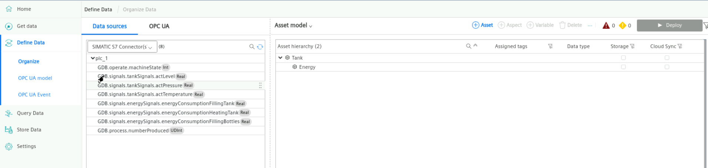

# Configuration


## Configure PLC Connection

To read data from the PLC and provide the data, we will use the SIMATIC S7 Connector to establish connection with the PLC via S7.

The SIMATIC S7 sends the data to the Databus, where the Database app (IIH Essentials) can collect what is needed.

In order to build this infrastructure, these apps must be configured properly:

- SIMATIC S7 Connector
- Common Configurator


### Configure the SIMATIC S7 Connector 

In your Industrial edge device open the common configurator and configure the S7 connector

This Configuration done locally at the Industrial edge Device

Add a data source:


Deploy and start the project.

Import the tags to S7 connector from Export.zip file exported from TIA portal by using export SCADA simatic tool in common configurator:


``` EXPORT.ZIP CAN BE FOUND ON THE DESKTOP ```


Add these 8 tags with 1 sec of acquisition cycle:
* GDB.operate.machineState
* GDB.signals.tankSignals.actLevel
* GDB.signals.tankSignals.actPressure
* GDB.signals.tankSignals.actTemperature
* GDB.signals.energySignals.energyConsumptionFillingTank
* GDB.signals.energySignals.energyConsumptionHeatingTank	
* GDB.signals.energySignals.energyConsumptionFillingBottles
* GDB.process.numberProduced

Import 
then deploy


## Mapping tags
To save the data from the s7 connector we must map them into assets.

In your Industrial edge device open the ```common configurator``` and open ```Define data```

Create two assets:
* Tank
  * Energy

<br>




