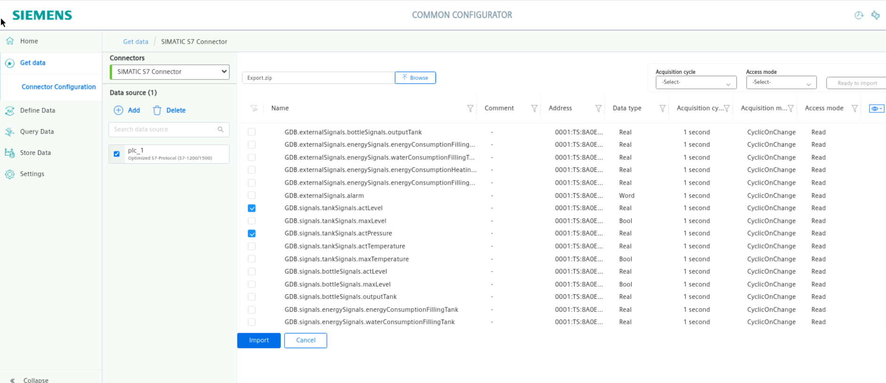

# Industrial Edge Playground - Hands-on with data


## Setup
We have two virtual machines available
* 1 Tia portal machine with plcsim
* 1 Linux jumphost to access the Industrial edge Device

The tia portal machine will be available to start, stop or edit the plc. it is also possible to open the HMI. The Linux jumphost has all the setting available to work with industrial edge.


## Configure PLC Connection

To read data from the PLC and provide the data, we will use the SIMATIC S7 Connector to establish connection with the PLC via S7.

The SIMATIC S7 sends the data to the Databus, where the Database app (IIH Essentials) can collect what is needed.

In order to build this infrastructure, these apps must be configured properly:

- SIMATIC S7 Connector
- Common Configurator


### Configure the SIMATIC S7 Connector 

In your Industrial edge device open the common configurator and configure the S7 connector

This Configuration done locally at the Industrial edge Device

Add a data source:


```The IP of the plc can be found in the Secrets.html```

Deploy and start the project.

Import the tags to S7 connector from Export.zip file exported from TIA portal by using export SCADA simatic tool in common configurator:


``` EXPORT.ZIP CAN BE FOUND ON THE DESKTOP ```
(or browse)





Add these 8 tags with 1 sec of acquisition cycle:
* GDB.operate.machineState
* GDB.signals.tankSignals.actLevel
* GDB.signals.tankSignals.actPressure
* GDB.signals.tankSignals.actTemperature
* GDB.signals.energySignals.energyConsumptionFillingTank
* GDB.signals.energySignals.energyConsumptionHeatingTank	
* GDB.signals.energySignals.energyConsumptionFillingBottles
* GDB.process.numberProduced

Import 
then deploy


## Mapping tags
To save the data from the s7 connector we must map them into assets.

In your Industrial edge device open the ```common configurator``` and open ```Define data```

Create two assets:
* Tank
  * Energy

<br>


<br>

Drag and drop the Tank related tags in Tank and the energy related tags in Energy.
Also check the storage checkboxes and deploy


### Mapping a KPI
Select the Energy Asset and create a new Variable 

Rename it to Total Energy by doubleclicking on the name (Variable1)


Then press on the Fx (function) button to create the KPI<br>
Drag and drop the 3 Energy variables to the screen and add + inbetween to sum then up.


press Save <br>

select storage again and deploy.


Now we Created the KPI

## Get insights in the stored data
To preview the data we can go to the store data tab. if we select the last-values we can see the data.


## Visualise the data in Energy Manager or performance insight
Continue on your own by using your data in performance insight or energy manager.

Go to the edge device interface and open the performance insight app or energy manager

