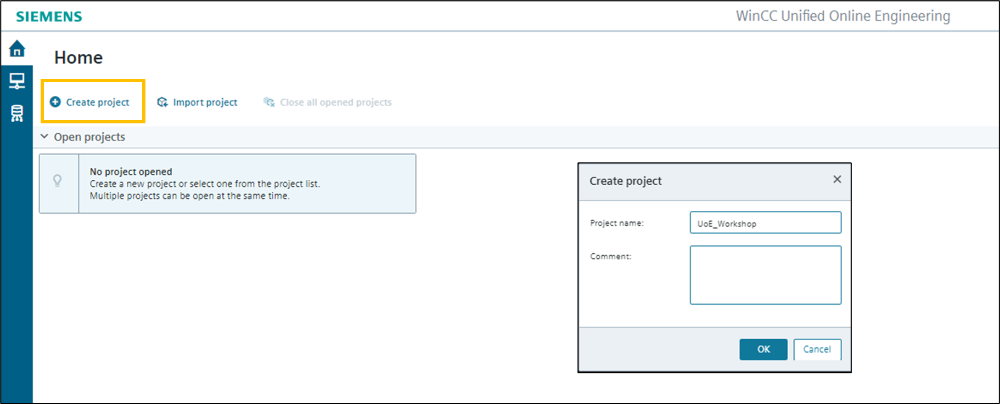
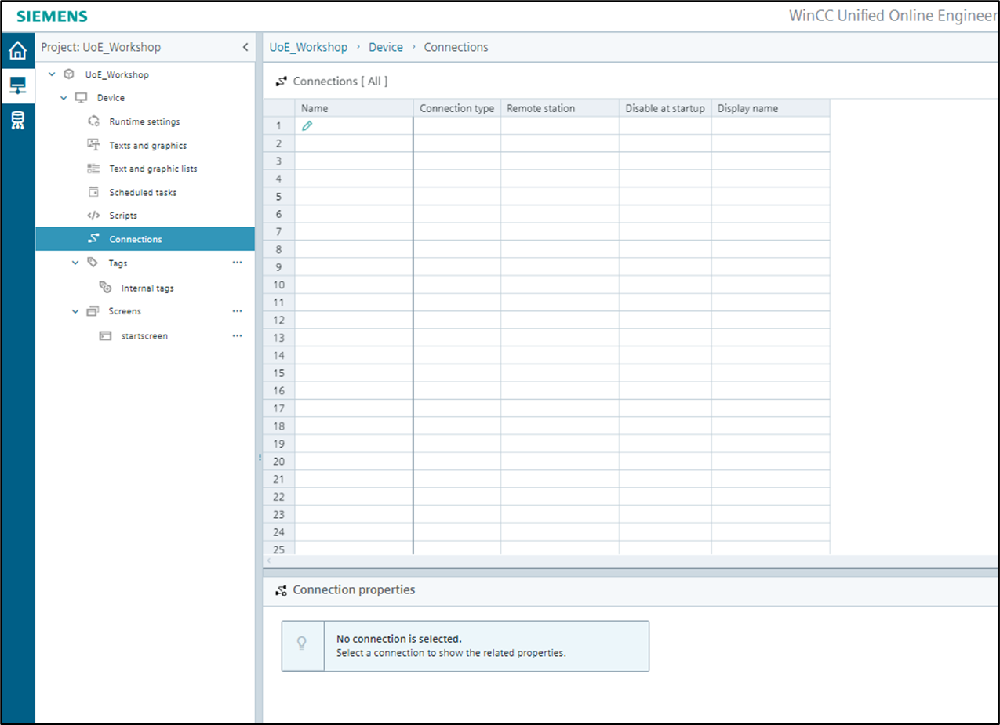
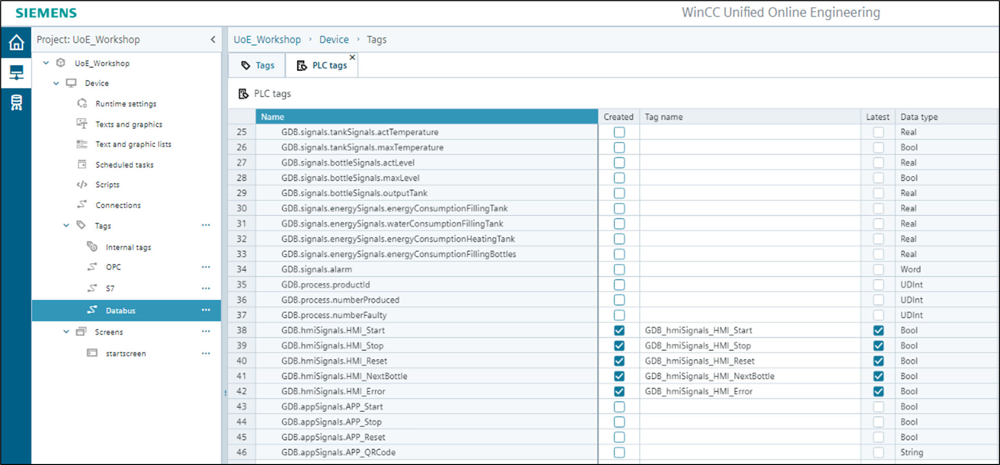
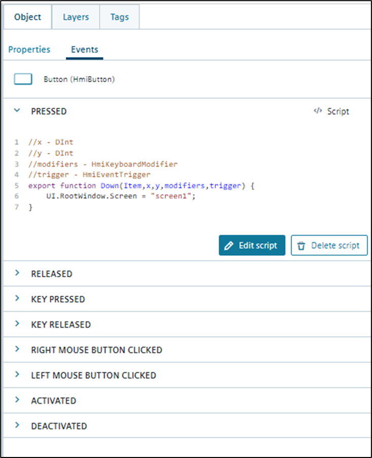
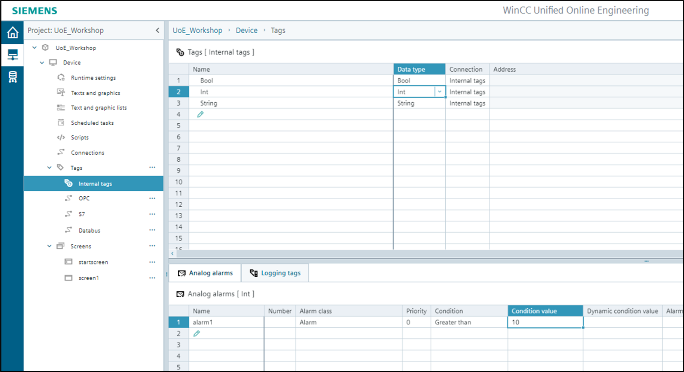

# WinCC Unified on Edge

- [Installation](#installation)
- [Creating a project](#creating-a-project) ⬅️(Start here)
- [Creating a device](#creating-a-device)
- [Creating a screen](#creating-a-screen)
- [Screen Items](#screen-items)
- [Connections](#connections)
  - [Browse IE Databus from WinCC Unified Online Engineering](#browse-ie-databus-from-wincc-unified-online-engineering)
- [Tags](#tags)
  - [Create tags out of connection](#create-tags-out-of-connection)
  - [Create internal tags](#create-internal-tags)
  - [Import tags from TIA Portal](#import-tags-from-tia-portal)
- [Connect tags to screen items](#connect-tags-to-screen-items)
- [Scripting](#scripting)
  - [Global Scripts](#global-scripts)
  - [Shortcuts](#shortcuts)
- [OPC UA Server](#opc-ua-server)
- [Load a project into runtime](#load-a-project-into-runtime)
  - [Remote Download](#remote-download)
  - [Offline Download](#offline-download)
- [Alarms](#alarms)
- [Logs](#logs)
- [Trends](#trends)
- [Start the runtime](#start-the-runtime)
- [Trace Settings](#trace-settings)

## Installation (Informational)

!The installation is already done for this workshop!

Download the apps "WinCC Unified Online Engineering" and "WinCC Unified Runtime" from the Industrial Edge HUB into your Industrial Edge Management. The applications should now be available in the IEM catalog.

1. Login on the [IEM](https://192.168.100.10:9443/pp/app/home) where you control your IED
   `demouser@edge.com`
   `Siemens1!`
2. Go to the [catalog](https://192.168.100.10:9443/pp/app/catalog)
3. Open the app "WinCC Unified Online Engineering" and install it on your IED
4. Open the app "WinCC Unified Runtime" and install it on your IED
5. Login to the IED where you installed the apps
6. Click on the app icon of "WinCC Unified Online Engineering" to open this app
7. Click on the app icon of "WinCC Unified Runtime" to open this app

## Creating a project

Log into your designated Industrial Edge device.

Username:`demouser@edge.com`

Password:`Siemens1!`

Once you are in the WinCC Unified Online Engineering you can click on 'Create project' to start a new engineering project:

Now you will see your created project where you can click on and start working on it:

## Creating a device

Clicking on a created project will lead you to the following screen:

On the left bar there will be available a tree with all the projects created. On the right bar we can start to deploy and create our device. Click on the 'Add device' button to create a new one:

Now, the device should appear created in the project:

## Creating a screen

Once we have created a device, its properties are shown when it is accessed:

In the left side menu, click on 'Screens' and then click on 'Add screen' button to add a new one:

Now the created screen will appear under 'Screens':

## Screen items

Once the screen is created and opened, items can be created by clicking on 'Add screen items' button:

A bar will appear with all the options available:

Place different elements and controls in the screen area and when they are created you will see in the right bar all the properties of the specific item:

On the properties bar you will see the 'most important proporties' section. The content depends on the screen item and is displayed in a separate section.

Add all the items you need. The autosaver will save any changes that are made.

## Connections

To create a connection between the WinCC Unifed on Industrial Edge and a PLC go to 'Connections':

At the office we have a physical PLC connected to the edge devices, we are able to connect to it using OPC UA, S7+ and the Databus.

Write a name for your connection, select the connection type "OPC UA" and enter the address of the PLC, which is `172.16.4.100:4840`:

Underneath 'Tags' in the left side menu, you will see the new connection created.

Click on the three dots and select 'Browse OPC UA server' to start searching for the data on the PLC:

When the search is done, the data will appear:

You can also try to create a S7 Plus connection and browse this connection for tags.

When browsing the PLC you will need to trust the S7 Plus certificate.

### Browse IE Databus from WinCC Unified Online Engineering (Optional)

!You may come back to this part later, for now you can go to the [Tags](#tags) part.The installation is already done for this workshop!

Go to connections, add a new connection and select the connection type 'IE Databus'. Adapt the metadata topic if it is required for your IE connector:

Add your databus credentials that are the same as the ones defined in the IEM Databus Configurator:

Username: `unified`

Password: `Edge123!`

Make sure to configure better passwords than this for actual Industrial Edge setups.

Browse the databus to have all the published tags that are configured in the metadata topic. Check the 'created' checkbox to import the tags needed:

Then, in the WinCC Unified Runtime, click on 'Settings' and add the databus credentials:

Username: `unified`

Password: `Edge123!`

Go to configuration and in the 'Tags' part select the ones that are needed to be published and suscribed. Also, enable the services for 'Tag Publishing' and 'Tag Suscribe':

## Tags

There are different ways to create tags in our WinCC Unifed on Industrial Edge.

### Create tags out of connection

When we establish a connection to a PLC, we can use these tags within our WinCC Unifed on IE project just by clicking on the 'Created' checkbox.

Create tags for the 'External Signals' and the 'HMI Signals":

### Create internal tags

Also internal tags can be manually created under 'Internal tags' in the left side menu:

### Import tags from TIA Portal (Information)

!This is informational only, no hands on!

The TIA Portal extension **'SIMATIC SCADA Export'** provides a mechanism to export the PLC configuration data (variables and alarms). The exported PLC data can be then imported as tags into the WinCC Unified Online Engineering.

To download the SIMATIC SCADA Export, open our SIOS-Portal and search for the entry "109748955" or click on this [link](https://support.industry.siemens.com/cs/document/109748955/simatic-scada-export-for-tia-portal?dti=0&lc=en-US). Download and install the fitting version for your TIA Portal version.

Right click on the PLC and click on Export to SIMATIC SCADA and enter the filename and define the path:

Open the project in WinCC Unified Online Engineering and go to 'Tags' on the left side menu. Click on the three dots > "Import S7/S7+ connection". Select the exported file and click on 'OK'.

The connection has been imported. You can see the tags imported and you can choose the desired PLC tags and PLC data types you want to use in the project by selecting 'created':

If you go to 'Tags', all the ones that were selected are ready to be used in the project:

Also if you go to 'Connections', both interfaces have been imported and if you have some certificates for secure communication, they are imported as well:

## Connect tags to screen items

Once the tags are created, they can be connected to the screen items. add a slider to the screen:

In properties go to three dots of the dynamization rectangle and select "Tags":

Select 'Tag...' and then choose a tag that you want to connect:

Repeat the process for any screen item that you want to connect. You can easily Drag & Drop a tag into your screen to create automatically an IO-field with connected HMI tag:

## Scripting

As same as working with Tia Portal in the WinCC part, scripting is also allowed in the app. For this part we are creating another screen to create a simple script to switch between two screens:

Place a button on the first screen, double click the button to give it a different text.

Go to the 'Events' tabs in the right side menu and click on 'Add script':

A scripting window opens. On the left side menu several predefined code templates are provided:

In this case, we can open the 'Screen' dropdown on the left side and drag the template 'Change base screen' into the script. Don't forget to rename the screen name inside the code:

Click on OK and the script will be applied for the button:

### Global scripts

To create a global module for your scripts go to 'Scripts' in the left side menu and create a global module with all the functions needed:

Then, on the scripting part of an item you can import all your global and predefined scripts to use them:

### Shortcuts

You can select system functions and enums via intellisense or autocompletion just by clicking 'ctrl' + 'space' shortcut on the keyboard:

By using the 'alt' + '.' shortcut you can jump to the definition of a function:

And using the 'ctrl' + 'i' shortcut the info about the function pops out:

## OPC UA Server

To operate as an OPC UA server go to the 'Runtime settings' in the left side menu and click on the opc ua server checkbox. The OPC UA Server can be accesed via Default port: 34002.

## Load a project into runtime

To load a project, select your device on the left side menu and scroll down to 'Runtime status':

Click on 'Download' and when the procces is finished click on 'OK':

Then click on 'Start runtime' and wait until the runtime status is on running:

### Remote Download (Information)

To load the project in runtime on other Edge Device, you just need to configure its IP adress on the device configuration:

### Offline Download (Information)

!This is informational only, no hands on!

You can create an offline runtime project in WinCC Unified Online Engineering by clicking on the 'Download' button in the section 'Offline download':

Then, in WinCC Unified Runtime on IE you can upload the file that was downloaded by clicking on the 'Upload' button:

## Alarms

The alarms are created at the desired trigger tag - in this case at an internal tag. We can create two different types: analog and discrete alarms. The alarm type depends on the selected tag data type. For this example we are creating both.

For the analog alarms, an 'Int' tag is created:

On the bottom menu, tab 'Analog alarms', we create all the alarms we need with it's conditions:

For the discrete alarms, the creation is made in the same way, but the data type must be 'Bool' or a 'Word':

Create these alarms and place a the necessary elements on the screen to trigget these alarms. Also place a 'Alarm control' on the screen.

When the runtime is active and the alarms are popped out they will appear in the chart:

## Logs

The logs can be created for each tag - in this case at an internal tag. We can choose two different logging modes: 'Cyclic' and 'On change'.

Create a logging tag with 'Cyclic' mode. On the bottom menu, tab 'Logging tags', the logging is created:

Create a logging tag with 'On change' mode:

Place a 'Process control' on the screen:

Go to the 'Columns' property located under the 'ProcessView' property of the process control.

Make both column one and two visible and connect the created logging tags to these columns.

Finally the logs are shown in the runtime:

## Trends

To add a trend go to the add screen items and in the advanced bar select trend control:

In its properties to add different trends to appear in the item, go to Trends:

And select the tag you want to control at the datasource property:

In the runtime the trend will be filled:

## Start the runtime

To start the runtime go to the Wincc Runtime app:

If the project downloaded is running you will see a green light that indicates that the runtime is ready:

Click on the WinCC Unified Runtime button:

And the Start Screen that is indicated in the project will appear:

To stop the runtime go back to your device and click on Stop runtime:

Wait until the runtime status is on not started:

And in the WinCC Runtime app a red light will be now on the project:

## Trace Settings (Informational)

!This is informational only, no hands on!

To download or forward traces from the WinCC Unified Online Engineering app go to the settings and enable the following settings:

Also you can download each trace separately .csv file going to the app's more info site:

You can also activate the trace forwarder and receive the traces with Trace Viewer foe analyzing the app:

- Trace Viewer is installed by WinCC Unified (Tia Portal)
- Activate the 'Receiver' mode via the following command on remote host:

`C:\ProgramFiles\Siemens\Automation\WinCCUnified\bin\RTILtraceTool.exe -mode receiver -tcp -host <IP of Edgebox> -port 35505`

