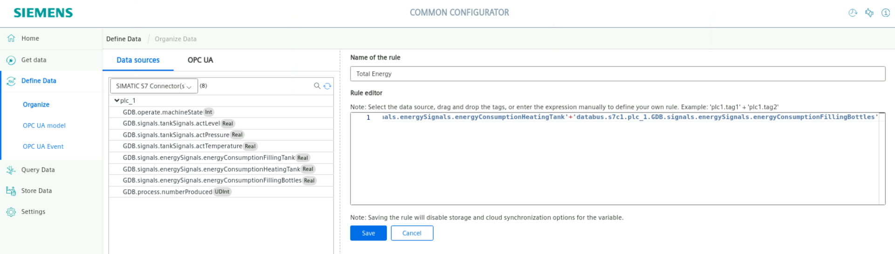

# Industrial Edge Playground - Hands-on with data
 
  *Final result*

## Virtual lab
We have two virtual machines available running in [vlab.siemens.cloud](https://vlab.siemens.cloud/) 
* Windows with Tia portal machine for PLCs engineering
* Linux jumphost as workstation

  *Virtual machine available*

## Architecture
Overview of how the machines communicate to the edge environment.

  *Complete architecture*

Components:
* virtual edge Management
  * Used for installation of software for edge devices

* Virtual edge device
  * Running the deployed applications

* Virtual PLC
  * Controlling machines

## Step 1: Install applications
1. Open google chrome on the desktop and read the secrets.html  

 

 *Secrets file*

 

2. Login on the "IEM" and "Onboarded IED1" on different tabs  
3. Open the management (IEM) and install apps via the catalog  
    * Common Configurator 
    * Databus 
    * IIH Essential 
    * IIH Semantics 
    * Registry Service 
    * SIMATIC S7 Connector 
4. Check if the apps are installed on the "Onboarded IED1"

## Step 2: Configure databus & Settings (MQTT)
We install the databus to let the apps communicate with eachother over MQTT on the edge device.

1. Open the management (IEM) > Data Connections and select databus
    * Launch on demoied1
2. Click on + next to users
    * Topic Name: ie/#
    * username: edge
    * password: edge
    * permission: Publish and Subscribe
3. Save
4. Deploy to demoied1

 *Databus configurator*

5. Open the Edge Device (Onboarded IED1) and open the app "Common Configurator"
6. Go to settings > Databus Credentials
7. Set the following and save:
  * Databus Service name = ie-databus:1883
  * User name = edge
  * Password = edge
8. do this on both tabs

 *Databus Credentials on common configurator*

## Step 3: Configure PLC Connection

To read data from the PLC and provide the data, we will use the SIMATIC S7 Connector to establish connection with the PLC via S7.

The SIMATIC S7 sends the data to the Databus, where the Database app (IIH Essentials) can collect what is needed.

Configure the SIMATIC S7 Connector:

1. Open the Edge Device (Onboarded IED1) and open the common configurator 
2. Select get data and Click the the S7 connector
3. Add a datasource
    * Protocol = Optimized s7
    * Name = PLC
    * PLC-Type = s7-1500
    * IP = PLC IP From secrets.html
4. Save

 *Adding Datasource and setting up PLC Connection*

5. Click on browse tags > start browse
6. Add these 8 tags with a 1s acquisition cycle:
    * GDB.operate.machineState
    * GDB.signals.tankSignals.actLevel
    * GDB.signals.tankSignals.actPressure
    * GDB.signals.tankSignals.actTemperature
    * GDB.signals.energySignals.energyConsumptionFillingTank
    * GDB.signals.energySignals.energyConsumptionHeatingTank	
    * GDB.signals.energySignals.energyConsumptionFillingBottles
    * GDB.process.numberProduced

 *Browsing tags*

7. Import and Add to datasource
8. Deploy 

 *Final result and deploy*

## Mapping tags
To save the data from the s7 connector we must map them into assets.

1. Open the Edge Device (Onboarded IED1) and open the common configurator 
2. Open Define Data and Create two Assets 
    * Tank
      * Energy

 

 

Drag and drop the Tank related tags in Tank and the energy related tags in Energy.
Also check the storage checkboxes and deploy

### Mapping a KPI
Select the Energy Asset and create a new Variable 

Rename it to Total Energy by doubleclicking on the name (Variable1)

Then press on the Fx (function) button to create the KPI 
Drag and drop the 3 Energy variables to the screen and add + inbetween to sum then up.

press Save  

select storage again and deploy.

Now we Created the KPI

## Get insights in the stored data
To preview the data we can go to the store data tab. if we select the last-values we can see the data.

## Visualise the data in Energy Manager or performance insight
Continue on your own by using this data in performance insight, energy manager, Cloud Connectivity or Custom application .

